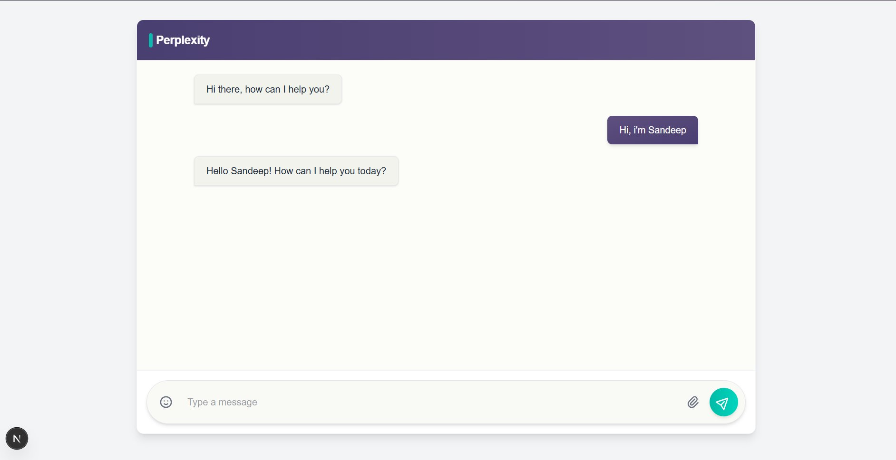

# Perplexity

A full-stack AI-powered chat application with web search capabilities.



## Tech Stack

- **Frontend:** Next.js 15, React 19, TypeScript, Tailwind CSS
- **Backend:** FastAPI, Python 3.11, LangChain, LangGraph, Google Generative AI, Tavily Search
- **Containerization:** Docker

## Project Structure

```
Perplexity/
│
├── client/   # Next.js frontend
│
└── server/   # FastAPI backend with AI and search
```

---

## Setup Instructions

### Prerequisites

- Node.js (v18+ recommended)
- Python 3.11+
- Docker (optional, for containerized backend)

---

### 1. Client (Frontend)

```bash
cd client
npm install
npm run dev
```

Visit [http://localhost:3000](http://localhost:3000) in your browser.

---

### 2. Server (Backend)

#### a. With Python

```bash
cd server
pip install -r requirements.txt
uvicorn app:app --reload --host 0.0.0.0 --port 8000
```

#### b. With Docker

```bash
cd server
docker build -t perplexity-server .
docker run -p 8000:8000 perplexity-server
```

---

## Environment Variables

- The backend uses environment variables (see `.env` and `load_dotenv()` in `app.py`) for API keys and configuration. Create a `.env` file in the `server/` directory as needed.

---

## Features

- Modern chat UI with React and Tailwind CSS
- AI-powered responses using Google Generative AI (Gemini)
- Web search integration via Tavily
- Real-time streaming responses (SSE)
- TypeScript for type safety

---

## License

MIT

